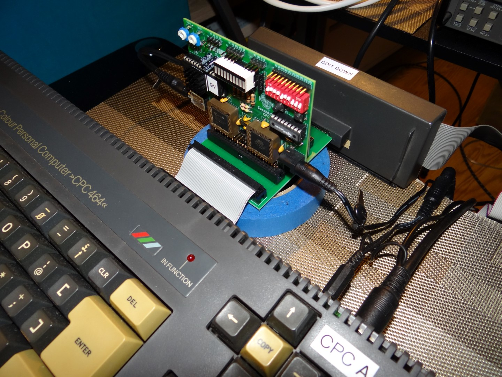
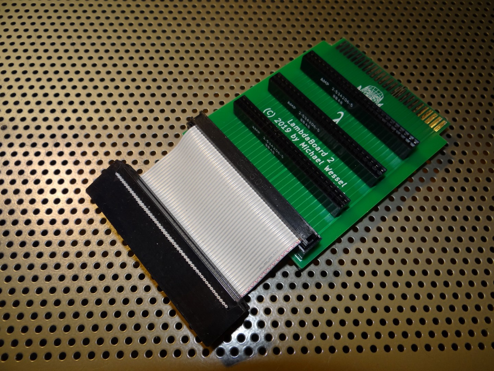
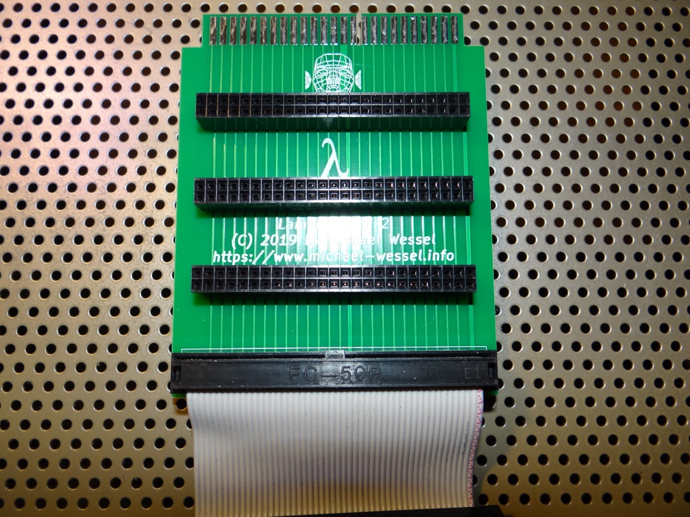
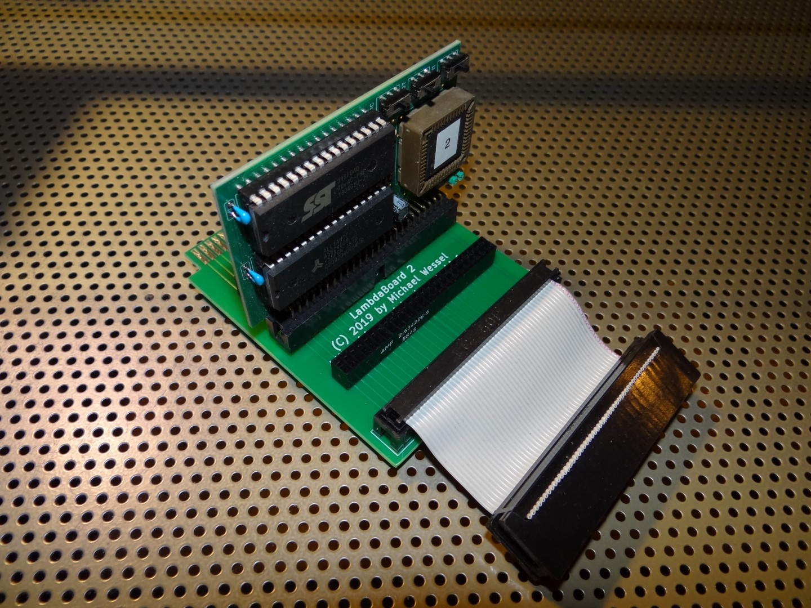
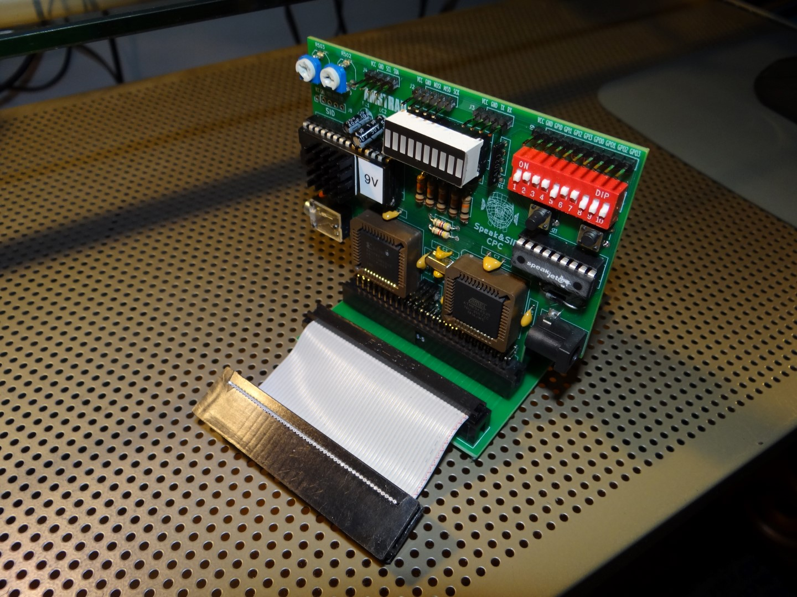
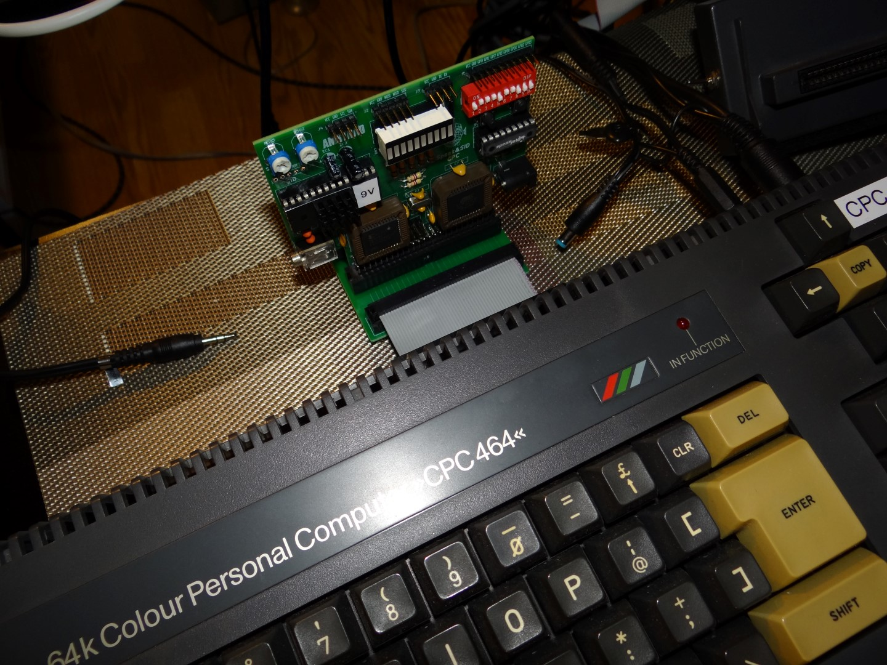
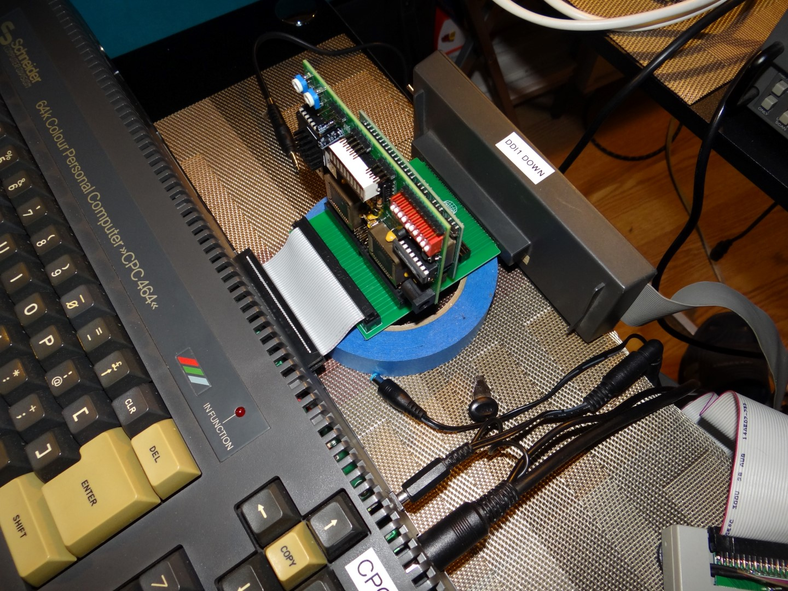

# LambdaBoard
An Expansion Connector Extender &amp; Backplane for the Amstrad / Schneider CPC

## Purpose 

Add 3 MX4-compatible expansion card slots to your Amstrad / Schneider CPC, without loosing the edge connector.

Key features are: 
1. 3 standard MX4 expansion slots 
2. Edge connector
3. Keyhole in edge connector 
4. Wide traces for good signal conductivity
5. Extra wide trace for GND and VCC -- unlike other backplane expanders for the CPC, LambdaBoard is capable of power the DDI-1 and DDI-3 without needing an extra PSU. An extra PSU is unnecessary for 90% of all CPC extensions. 

## Application Examples 

  
  
  
  
  
  
  

## Gerbers 

The Gerbers are [here](gerbers/LambdaBoard-v2.zip) 

## OshPark Link 

Also, here is link to [OshPark for immediate ordering of PCBs.](https://oshpark.com/shared_projects/gfReKSs4) 

## Enjoy! 

